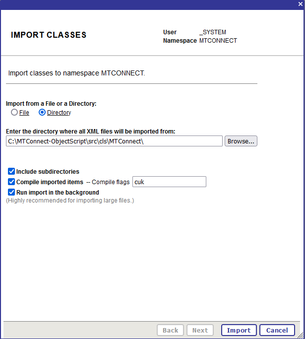

# MTConnect-ObjectScript

An [InterSystems ObjectScript](https://docs.intersystems.com/irislatest/csp/docbook/DocBook.UI.Page.cls?KEY=GCOS_INTRO) implementation, thats builds an ObjectScript Class based on a [MTConnect](https://www.mtconnect.org/) probe file and adds data from a current file.

---

* [Installation](#installation)
* [MTConnect.MSG.MTConnectRequest / Response](#mtconnectmsgmtconnectrequest--response)
* [MTConnect.BO.ClassBuilder](#mtconnectboclassbuilder)
  * [Request](#request)
  * [Response](#response)
  * [Settings](#settings)
* [MTConnect.MSG.CreateDataTypeRequest](#mtconnectmsgcreatedatatyperequest)
* [MTConnect.DataTypesBuilder / Operation](#mtconnectdatatypesbuilder--operation)
* [Example Production](#example-production)
  * [DataTypes](#datatypes)
  * [Class Builder](#class-builder)
* [Bugs](#bugs)
* [Release Notes](#release-notes)

---

## Installation

* Download the [latest realease](https://github.com/phil1436/MTConnect-ObjectScript/releases/latest)
* Extract the file
* In the [InterSystems Management Portal](https://docs.intersystems.com/irislatest/csp/docbook/DocBook.UI.Page.cls?KEY=GSA_USING_PORTAL) navigate to `System Explorer > Classes`
* Click on `Import`
* Under *Import from File or a Directory* make sure to select *Directory*
* Enter the path to the [MTConnect Folder](cls/MTConnect) under `cls/MTConnect`
* Click on `Import`

---

## [MTConnect.MSG.MTConnectRequest](cls/MTConnect/MSG/MTConnectRequest.cls) / [Response](cls/MTConnect/MSG/MTConnectResponse.cls)

* `probe`: Holds the data from the probe file.
* `probeFromFile`: When enabled the probe property contains an absolute path to the probe file. When disabled the probe property contains the probe file as a string.
* `current`: Holds the data from the current file.
* `currentToFile`: When enabled the current property contains an absolute path to the current file. When disabled the current property contains the current file as a string.
* `recievedLine`(optional): Holds a received string. (Used for *cleardata*)
* `className`(will be set): The complete class name of the generated class.
* `logClass`(will be set): The complete class name of the log class(will not be used!).

---

## [MTConnect.BO.ClassBuilder](cls/MTConnect/BO/ClassBuilder.cls)

A Business Operation, that builts an ObjectScript class based on a MTConnect probe file. After the class is successfully generated, the operation inserts data from a MTConnect current file.

### Request

[MTConnect.MSG.MTConnectRequest](cls/MTConnect/MSG/MTConnectRequest.cls)

### Response

[MTConnect.MSG.MTConnectResponse](cls/MTConnect/MSG/MTConnectResponse.cls)

### Settings

#### MTConnect

* `PackageName`: The package where the class will be generated in.
* `suffixClass`: A suffix for the class name.
* `Kind`: *ID* or *Name*. Sets from which attributes the class will be build.
* `ClearData`: When enabled deletes all data, when a `***CL***` message is received.
* `SuperClasses`: Define comma seperated superclasses for the class.

#### MTConnectDataTypes

* `GenerateDataTypes`: When enabled the MTConnect Datatypes will be generated automatically.
* `DataTypesPackage`: The package where the MTConnect datatypes exists or will be generated in.
* `GenerateIsValid`: When enabled generates a IsValid Method for the datatypes
* `GenerateNormalize`: When enabled generates a Normalize Method for the datatypes
* `GenerateLogicalToDisplay`: When enabled generates a LogicalToDisplay Method for the datatypes
* `GenerateDisplayToLogical`: When enabled generates a DisplayToLogical Method for the datatypes

#### LOG

* `Log`: When enabled all changes will be written to a log file.
* `LogFile`: An absolute path to the log file.

---

## [MTConnect.MSG.CreateDataTypeRequest](cls/MTConnect/MSG/CreateDataTypeRequest.cls)

* `Name`: The name of the datatype.
* `Unit`: The unit to display the datatype with.
* `DataType`: The underlying ObjectScript type (Currently only works with *%String* and *%Double*).
* `AllowedStringValues`: Comma separated list for the allowed values. If left empty all values will be allowed. (only used when `DataType` is *%String*)
* `AllowedNumericMaxValue`: The maximum value that is allowed. If left empty all values will be allowed. (only used when `DataType` is *%Double*)
* `AllowedNumericMinValue`: The minimum value that is allowed. If left empty all values will be allowed. (only used when `DataType` is *%Double*)

---

## [MTConnect.DataTypesBuilder](cls/MTConnect/DataTypesBuilder.cls) / [Operation](cls/MTConnect/BO/DataTypesBuilderOperation.cls)

Builds MTConnect Datatypes based on a [MTConnect.MSG.CreateDataTypeRequest](cls/MTConnect/MSG/CreateDataTypeRequest.cls).

### Methods

* `Execute`: Builds the datatype.

---

## [Example Production](cls/MTConnect/ExampleProduction)

A simple [Production](cls/MTConnect/ExampleProduction/Production.cls) to show the usage of the [DataTypesBuilder Operation](cls/MTConnect/BO/DataTypesBuilderOperation.cls) and the [ClassBuilder Operation](cls/MTConnect/BO/ClassBuilder.cls).

How to open and start the Production:

* In the InterSystems Management Portal navigate to `Interoperabilty > Configure > Production > Go`
* Click on `Production Settings`
* Navigate to `Actions > Open`
* Choose `MTConnect > ExampleProduction > Production > Go`
* Click on `Start`

### DataTypes

An example for how to use the [DataTypesBuilder Operation](cls/MTConnect/BO/DataTypesBuilderOperation.cls) to create MTConnect DataTypes.

* From the *category* dropdown menu choose `DataTypes`
* Choose the `DataTypes Process`
* Navigate to `Actions > Test`
* From the *Request Type* dropdown menu choose `Ens.StringRequest`
  * Type in the `StringValue` field *String* to generate a String MTConnect DataType
  **OR**
  * Type in the `StringValue` field *Double* to generate a Double MTConnect DataType
* Click on `Invoke Testing Service`
* You can follow the *Visual Trace* to see how the DataType was created
* You will find the DataTypes under `MTConnect.ExampleProduction.DataTypes`

### Class Builder

An example for how to use the [ClassBuilder Operation](cls/MTConnect/BO/ClassBuilder.cls) to create MTConnect Class from a MTConnect [Probe](http://mtconnect.mazakcorp.com:5609/probe) and [Current](http://mtconnect.mazakcorp.com:5609/current) file.

* From the *category* dropdown menu choose `Class Builder`
* Choose the `Class Builder Process`
* Navigate to `Actions > Test`
* From the *Request Type* dropdown menu choose `Ens.Request`
* Click on `Invoke Testing Service`
* You can follow the *Visual Trace* to see how the MTConnect Class was created
* You will find the MTConnect Class under `MTConnect.ExampleProduction.BuiltClasses`
* The Operation will also generate MTConnect DataTypes based on the files. You can find them under `MTConnect.ExampleProduction.DataTypes`

---

## Bugs

* *no known bugs*

---

## [Release Notes](https://github.com/phil1436/MTConnect-ObjectScript/blob/master/CHANGELOG.md)

### [v0.0.3](https://github.com/phil1436/MTConnect-ObjectScript/tree/0.0.3)

### [v0.0.2](https://github.com/phil1436/MTConnect-ObjectScript/tree/0.0.2)

### [v0.0.1](https://github.com/phil1436/MTConnect-ObjectScript/tree/0.0.1)

---

by Jannis S. & Philipp B.

powered by [InterSystems](https://www.intersystems.com/).

*This application is **not** supported by InterSystems Corporation.*
